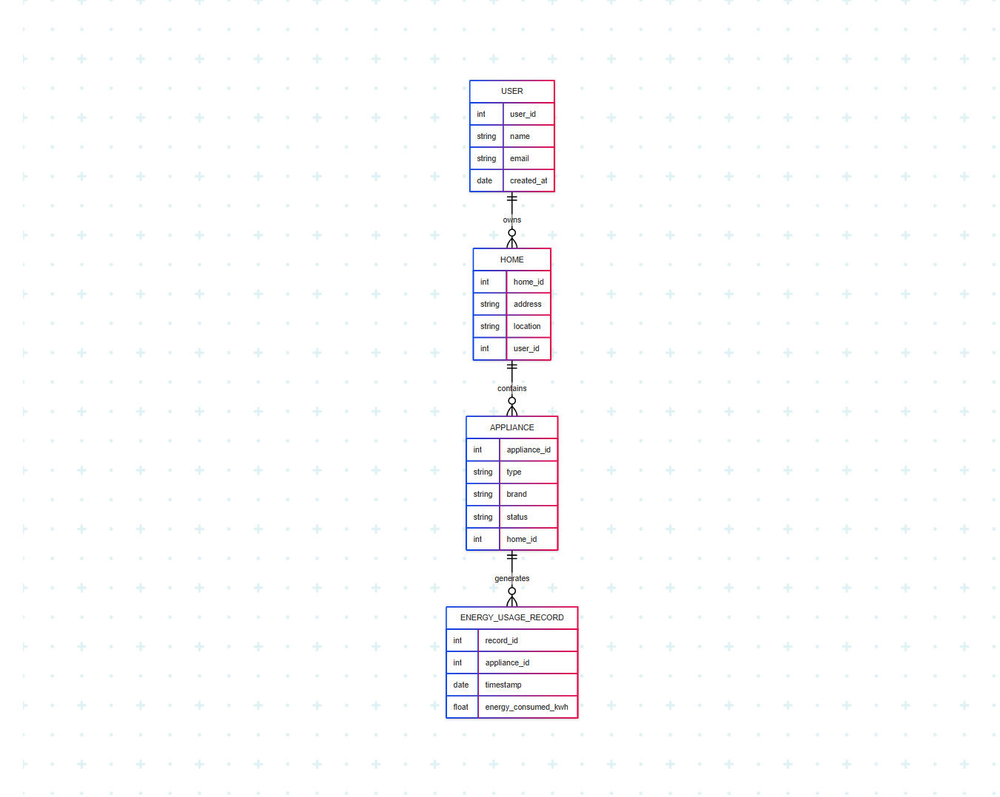

# 📘 Phase III – Logical Model Design

## 🧩 Objective

Design a normalized and well-structured logical data model that defines the entities, attributes, and relationships needed for the Smart Home Energy Management System.

---

## 🔧 Entities & Attributes

### USER
- `user_id` (PK): NUMBER  
- `name`: VARCHAR2(50)  
- `email`: VARCHAR2(100)  
- `created_at`: DATE  

### HOME
- `home_id` (PK): NUMBER  
- `address`: VARCHAR2(150)  
- `location`: VARCHAR2(100)  
- `user_id` (FK): REFERENCES `USER(user_id)`  

### APPLIANCE
- `appliance_id` (PK): NUMBER  
- `type`: VARCHAR2(50)  
- `brand`: VARCHAR2(50)  
- `status`: VARCHAR2(20) -- e.g., ON/OFF/IDLE  
- `home_id` (FK): REFERENCES `HOME(home_id)`  

### ENERGY_USAGE_RECORD
- `record_id` (PK): NUMBER  
- `appliance_id` (FK): REFERENCES `APPLIANCE(appliance_id)`  
- `timestamp`: DATE  
- `energy_consumed_kwh`: NUMBER(5,2)  

---

## 🔗 Relationships

- One `USER` can own multiple `HOMES`
- One `HOME` can contain multiple `APPLIANCES`
- One `APPLIANCE` can generate multiple `ENERGY_USAGE_RECORDS`

---

## 🛠️ Constraints

- **NOT NULL** on all primary keys and required fields  
- **UNIQUE** on `email` in `USER`  
- **CHECK** constraint on `APPLIANCE.status` (e.g., ON, OFF, IDLE)  
- **DEFAULT** for `USER.created_at` set to `SYSDATE`  

---

## 🧮 Normalization

The design follows **Third Normal Form (3NF)**:
- 1NF: Atomic attribute values  
- 2NF: All attributes fully depend on the primary key  
- 3NF: No transitive dependencies  

---

## 🖼️ ERD Diagram

> 📷 **Insert your ERD screenshot below**  
> 

---