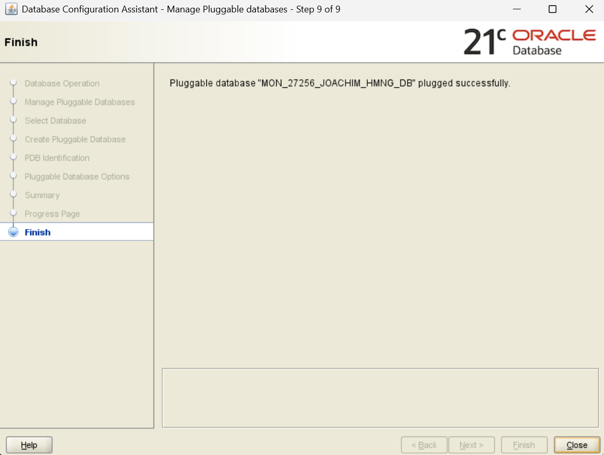
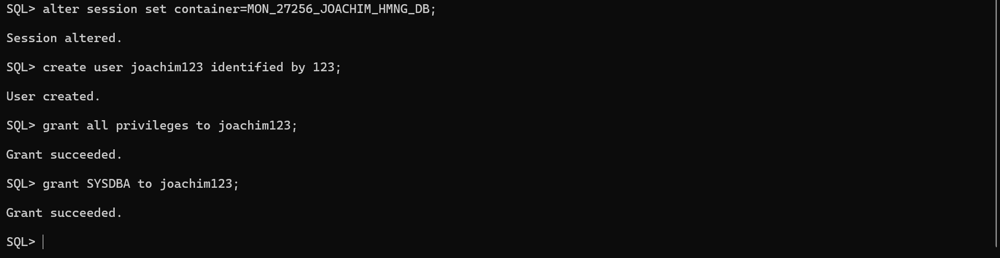
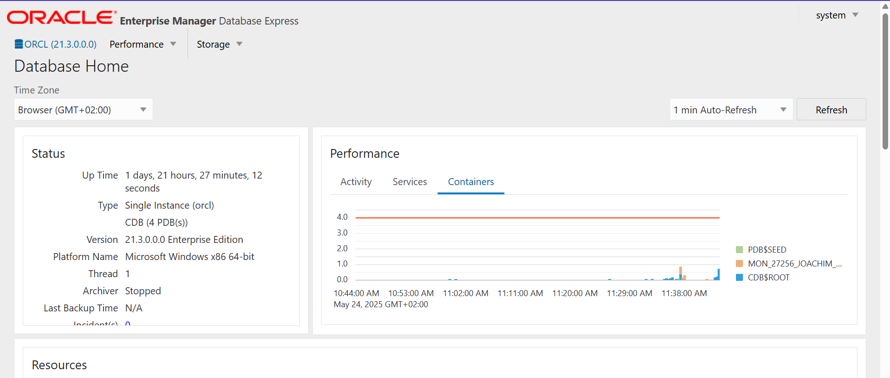

# 📘 Phase III – Logical Model Design

## 🧩 Objective

Design a normalized and well-structured logical data model that defines the entities, attributes, and relationships needed for the Smart Home Energy Management System.

---

## 🔧 Entities & Attributes

### USER
- `user_id` (PK): NUMBER  
- `name`: VARCHAR2(50)  
- `email`: VARCHAR2(100)  
- `created_at`: DATE  

### HOME
- `home_id` (PK): NUMBER  
- `address`: VARCHAR2(150)  
- `location`: VARCHAR2(100)  
- `user_id` (FK): REFERENCES `USER(user_id)`  

### APPLIANCE
- `appliance_id` (PK): NUMBER  
- `type`: VARCHAR2(50)  
- `brand`: VARCHAR2(50)  
- `status`: VARCHAR2(20) -- e.g., ON/OFF/IDLE  
- `home_id` (FK): REFERENCES `HOME(home_id)`  

### ENERGY_USAGE_RECORD
- `record_id` (PK): NUMBER  
- `appliance_id` (FK): REFERENCES `APPLIANCE(appliance_id)`  
- `timestamp`: DATE  
- `energy_consumed_kwh`: NUMBER(5,2)  

---

## 🔗 Relationships

- One `USER` can own multiple `HOMES`
- One `HOME` can contain multiple `APPLIANCES`
- One `APPLIANCE` can generate multiple `ENERGY_USAGE_RECORDS`

---

## 🛠️ Constraints

- **NOT NULL** on all primary keys and required fields  
- **UNIQUE** on `email` in `USER`  
- **CHECK** constraint on `APPLIANCE.status` (e.g., ON, OFF, IDLE)  
- **DEFAULT** for `USER.created_at` set to `SYSDATE`  

---

## 🧮 Normalization

The design follows **Third Normal Form (3NF)**:
- 1NF: Atomic attribute values  
- 2NF: All attributes fully depend on the primary key  
- 3NF: No transitive dependencies  

---

## 🖼️ ERD Diagram

> 📷 **Insert your ERD screenshot below**  
> 

---
# 💾 Phase IV – Physical Database Creation

## 🧩 Objective

Establish the physical database environment using Oracle's pluggable architecture. This includes creating the pluggable database (PDB), setting up super admin privileges, and confirming accessibility via Oracle Enterprise Manager (OEM).

---

## ⚙️ Pluggable Database (PDB) Setup

A dedicated PDB was created for the project using the following naming convention:

This PDB will store all tables, procedures, and related components for the Smart Home Energy Management System.

> 📷 **PDB Creation Confirmation**  
> Description: This screenshot shows the successful creation of the pluggable database using Oracle tools. It confirms that the database is live and accessible for development.  
---
> 

---

## 🛡️ Super Admin Privileges Setup

The project user was granted full admin privileges to enable schema-level and system-level operations such as table creation, auditing, and trigger management.

> 📷 **Super Admin Privileges Granted**  
> Description: This screenshot displays the privilege assignment interface, confirming that the project account has super admin rights in the PDB.  
---
> 

---

## 📊 Oracle Enterprise Manager (OEM) Access

To ensure full visibility into the database's performance and activities, Oracle Enterprise Manager (OEM) was configured and successfully connected to the PDB.

> 📷 **OEM Access & Login**  
> Description: This screenshot shows the user successfully logged into Oracle Enterprise Manager, with access to monitoring tools, session activity, and database status for the Smart Home Energy Management System.  
---
> 

---

