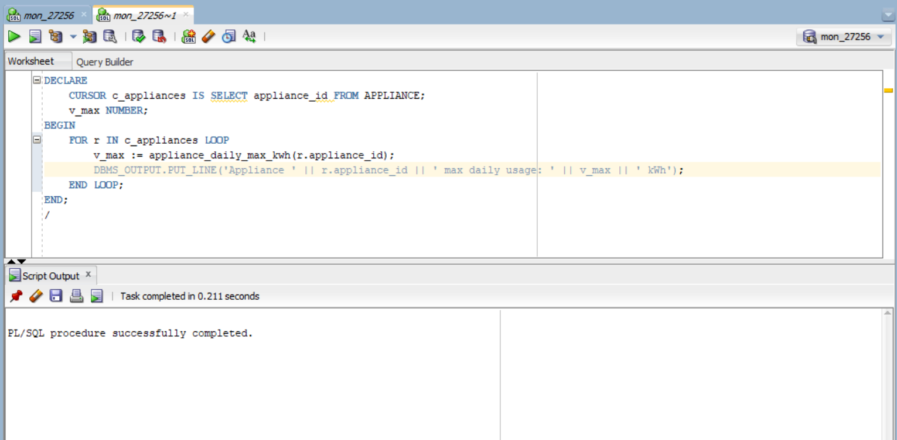

# 📘 Phase III – Logical Model Design

## 🧩 Objective

Design a normalized and well-structured logical data model that defines the entities, attributes, and relationships needed for the Smart Home Energy Management System.

---

## 🔧 Entities & Attributes

### USER
- `user_id` (PK): NUMBER  
- `name`: VARCHAR2(50)  
- `email`: VARCHAR2(100)  
- `created_at`: DATE  

### HOME
- `home_id` (PK): NUMBER  
- `address`: VARCHAR2(150)  
- `location`: VARCHAR2(100)  
- `user_id` (FK): REFERENCES `USER(user_id)`  

### APPLIANCE
- `appliance_id` (PK): NUMBER  
- `type`: VARCHAR2(50)  
- `brand`: VARCHAR2(50)  
- `status`: VARCHAR2(20) -- e.g., ON/OFF/IDLE  
- `home_id` (FK): REFERENCES `HOME(home_id)`  

### ENERGY_USAGE_RECORD
- `record_id` (PK): NUMBER  
- `appliance_id` (FK): REFERENCES `APPLIANCE(appliance_id)`  
- `timestamp`: DATE  
- `energy_consumed_kwh`: NUMBER(5,2)  

---

## 🔗 Relationships

- One `USER` can own multiple `HOMES`
- One `HOME` can contain multiple `APPLIANCES`
- One `APPLIANCE` can generate multiple `ENERGY_USAGE_RECORDS`

---

## 🛠️ Constraints

- **NOT NULL** on all primary keys and required fields  
- **UNIQUE** on `email` in `USER`  
- **CHECK** constraint on `APPLIANCE.status` (e.g., ON, OFF, IDLE)  
- **DEFAULT** for `USER.created_at` set to `SYSDATE`  

---

## 🧮 Normalization

The design follows **Third Normal Form (3NF)**:
- 1NF: Atomic attribute values  
- 2NF: All attributes fully depend on the primary key  
- 3NF: No transitive dependencies  

---

## 🖼️ ERD Diagram

> 📷 **Insert your ERD screenshot below**  
> 

---
# 💾 Phase IV – Physical Database Creation

## 🧩 Objective

Establish the physical database environment using Oracle's pluggable architecture. This includes creating the pluggable database (PDB), setting up super admin privileges, and confirming accessibility via Oracle Enterprise Manager (OEM).

---

## ⚙️ Pluggable Database (PDB) Setup

A dedicated PDB was created for the project using the following naming convention:

This PDB will store all tables, procedures, and related components for the Smart Home Energy Management System.

> 📷 **PDB Creation Confirmation**  
> Description: This screenshot shows the successful creation of the pluggable database using Oracle tools. It confirms that the database is live and accessible for development.  
---
> 

---

## 🛡️ Super Admin Privileges Setup

The project user was granted full admin privileges to enable schema-level and system-level operations such as table creation, auditing, and trigger management.

> 📷 **Super Admin Privileges Granted**  
> Description: This screenshot displays the privilege assignment interface, confirming that the project account has super admin rights in the PDB.  
---
> 

---

## 📊 Oracle Enterprise Manager (OEM) Access

To ensure full visibility into the database's performance and activities, Oracle Enterprise Manager (OEM) was configured and successfully connected to the PDB.

> 📷 **OEM Access & Login**  
> Description: This screenshot shows the user successfully logged into Oracle Enterprise Manager, with access to monitoring tools, session activity, and database status for the Smart Home Energy Management System.  
---
> 

---
# 📘 Phase V: Table Implementation & Data Integrity

## 🎯 Phase Objective

The goal of Phase V is to convert the logical data model into physical Oracle SQL tables and ensure the integrity, consistency, and validity of the data through constraints and test data insertion.

---

## 📁 Deliverables

### 1. Table Creation
- All tables from the logical model (USER, HOME, APPLIANCE, ENERGY_USAGE_RECORD) were created in the Oracle database.
- Attributes and data types match the logical design.

🖼️ **Screenshot: Table Creation in SQL Developer**

### 2. Data Integrity Implementation
- **NOT NULL**: Enforced on all primary keys and required fields.
- **UNIQUE**: Enforced on `USER.email` to avoid duplicate entries.
- **CHECK**: Enforced on `APPLIANCE.status` with values (`ON`, `OFF`, `IDLE`) only.
- **DEFAULT**: `USER.created_at` auto-fills with `SYSDATE` if not provided.
- **FOREIGN KEYS**:
  - `HOME.user_id → USER.user_id`
  - `APPLIANCE.home_id → HOME.home_id`
  - `ENERGY_USAGE_RECORD.appliance_id → APPLIANCE.appliance_id`

These constraints ensure that invalid or orphaned data cannot enter the system.

### 3. Realistic Data Insertion
- Sample records were inserted for all tables.
- All values respect constraints and relationships, simulating realistic usage of smart homes.

🖼️ **Screenshot: Data Insertion Output**

---

## 🔗 Entity Relationships Recap

- One USER → Many HOMES  
- One HOME → Many APPLIANCES  
- One APPLIANCE → Many ENERGY_USAGE_RECORDS

---

## 📊 Benefits of Data Integrity

- Prevents invalid data entries (e.g., negative energy values, orphaned homes)
- Supports accurate analytics and reporting in later phases
- Enforces business rules and enhances database reliability
- Protects relationships between entities

---
# PL/SQL Capstone Project - Phase VI
**Smart Home Energy Management System**  
*Author: NGIRINSHUTI MUGISHA Joachim*  
*Course: Database Development with PL/SQL*  
*Date: [Current Date]*

---

## 📋 Phase VI Objectives
- Implement analytical queries using window functions
- Develop PL/SQL procedures and functions
- Create a package for energy management operations
- Test database interactions and transactions

---

## 📂 Activities

### 1.Problem Statement:
“Identify appliances that consumed more than 5 kWh per day using analytic functions, and display the max daily usage per appliance.”

---
### 2. Analytical Query: Daily Energy Consumption Analysis
  
*Identifies appliances with above-average energy usage*

---

### 3. Procedure: Log Energy Record
  
*Inserts new energy consumption records*

---

### 4. Function: Calculate Appliance Daily Max kWh
  
*Returns maximum daily consumption for an appliance*

---

### 5. Cursor Implementation
  
*Displays max daily usage for all appliances*

---

### 6. Smart Energy Package
  
*Consolidates procedures and functions*

---

### 7. Testing Results
  
*Verification of all implemented components*

---

## 🛠️ Technical Specifications
- **Database:** Oracle PL/SQL
- **Tools:** SQL Developer, Oracle Enterprise Manager
- **Tables Used:** 
  - `USER`
  - `HOME` 
  - `APPLIANCE`
  - `ENERGY_USAGE_RECORD`

---

